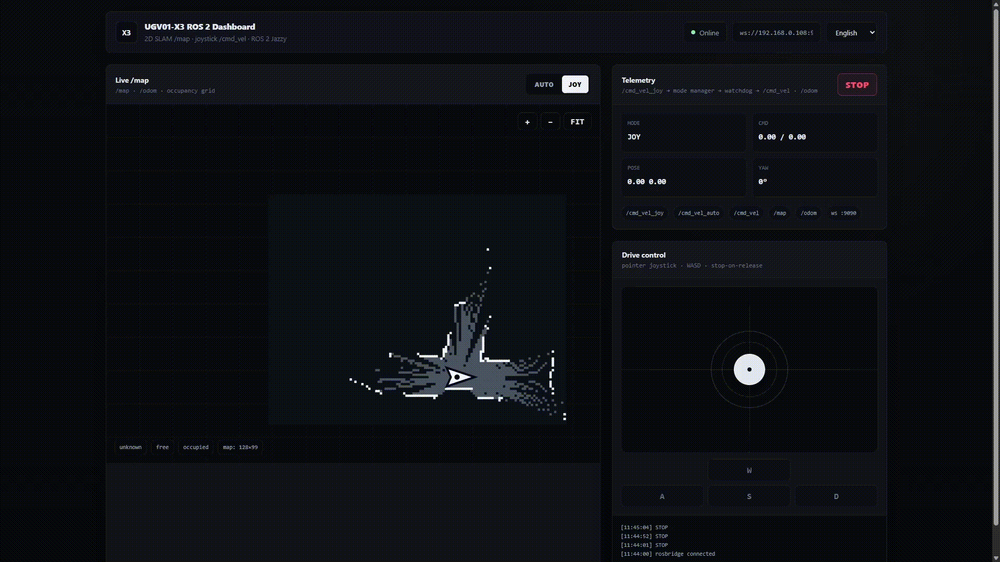
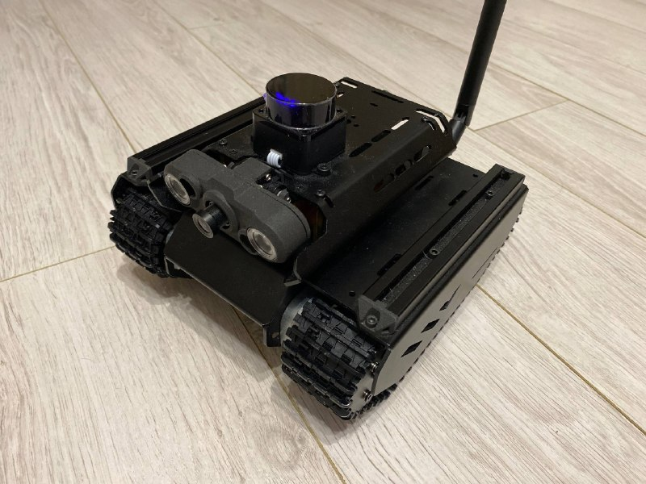

# ugv01-x3 ros 2 web slam

working progress demo of a **waveshare ugv01-x3** mobile robot running **ros 2 jazzy**, **2d lidar slam**, and a custom **web dashboard** for manual and autonomous control.

this project is not a final product yet. it is a snapshot of the current working result: mapping, web control, auto/joy switching, and basic safety logic are already working. the project will be improved further, with **nav2 integration planned for the future**.

## demo

[](https://www.youtube.com/watch?v=Ok5jk4S6Ps8)

[watch the demo on youtube](https://www.youtube.com/watch?v=Ok5jk4S6Ps8)

## robot platform



## current features

- ros 2 jazzy based robot stack
- 2d slam mapping with `slam_toolbox`
- ld19 / ldlidar laser scanner
- custom ugv01-x3 urdf model
- web dashboard for desktop and mobile
- live `/map` visualization in browser
- web joystick control
- `auto` / `joy` mode switching
- stop button
- rosbridge websocket connection
- command mode manager
- cmd_vel watchdog safety layer
- autonomous exploration script prototype
- launch files for web mode with and without rviz

## hardware and software setup

main setup used in this project:

- robot platform: **waveshare ugv01-x3**
- compute: **raspberry pi 5**
- os: **ubuntu 24.04**
- ros: **ros 2 jazzy**
- lidar: **ld19 / ldlidar**
- motor controller: waveshare esp32 robot controller
- browser dashboard: html/css/javascript + rosbridge
- backend server: python `server.py`

## system architecture

```text
web joystick
  -> /cmd_vel_joy
  -> cmd_vel_mode_manager
  -> /cmd_vel_web
  -> cmd_vel_watchdog
  -> /cmd_vel
  -> ugv_odom
  -> esp32 / motors
```

autonomous mode:

```text
auto_explore
  -> /cmd_vel_auto
  -> cmd_vel_mode_manager
  -> /cmd_vel_web
  -> cmd_vel_watchdog
  -> /cmd_vel
  -> ugv_odom
  -> esp32 / motors
```

mapping pipeline:

```text
ld19 lidar
  -> /ldlidar_node/scan
  -> slam_toolbox
  -> /map
  -> web dashboard / rviz
```

## main ros topics

```text
/map
/odom
/ldlidar_node/scan
/cmd_vel_joy
/cmd_vel_auto
/cmd_vel_web
/cmd_vel
/ugv01/mode
/ugv01/stop
```

## launch without rviz

recommended for normal web-dashboard operation on raspberry pi 5:

```bash
cd ~/ros2_ws
source /opt/ros/jazzy/setup.bash
source install/setup.bash

ros2 launch ugv01_room_explore web_mapping.launch.py serial_port:=/dev/ttyUSB0 lidar_model:=LD19 use_rviz:=false
```

## launch with rviz

use this for debugging, visualization, and checking tf / robot model:

```bash
cd ~/ros2_ws
source /opt/ros/jazzy/setup.bash
source install/setup.bash

ros2 launch ugv01_room_explore web_mapping_rviz.launch.py
```

## start web dashboard

run the dashboard server in a separate terminal:

```bash
cd ~/ros2_ws/src/ugv01-room-explore
python3 web/server.py
```

open in browser:

```text
http://<robot-ip>:8080
```

example:

```text
http://192.168.0.108:8080
```

rosbridge websocket runs on:

```text
ws://<robot-ip>:9090
```

## lidar lifecycle helper

if the lidar node starts but remains unconfigured, activate it manually:

```bash
source /opt/ros/jazzy/setup.bash
source ~/ros2_ws/install/setup.bash

ros2 lifecycle get /ldlidar_node
ros2 lifecycle set /ldlidar_node configure
sleep 5
ros2 lifecycle set /ldlidar_node activate
sleep 3

ros2 lifecycle get /ldlidar_node
ros2 topic hz /ldlidar_node/scan
```

expected result:

```text
active [3]
average rate: about 9-10 hz
```

## safety logic

the web dashboard does not publish directly to `/cmd_vel`.

commands pass through:

1. `cmd_vel_mode_manager`
2. `cmd_vel_watchdog`
3. `ugv_odom`

if web commands stop arriving, the watchdog publishes zero velocity.

## current status

working:

- web dashboard
- live 2d map display
- desktop control
- mobile control
- joystick driving
- auto/joy switching
- stop button
- basic autonomous movement
- 2d slam mapping

still in progress:

- cleaner autonomous behavior tuning
- better readme media and documentation
- improved demo video
- saved map / localization workflow
- nav2 integration
- more robust launch automation

## next steps

this project is still moving, so the next things i want to add are:

- add nav2 for real autonomous navigation
- make the auto mode smoother and safer
- add saved-map mode for running on an existing map
- improve robot position drawing in the web map
- polish the dashboard ui 
- record a cleaner public demo video

## repository note

this is a work-in-progress robot project built around the waveshare ugv01-x3, ros 2 jazzy and a web dashboard. the current version already works, but it is still experimental and will keep changing.

the goal is simple: build a small but real ros 2 mobile robot platform — basically a cool little machine for my plush teto, with mapping, web control, autonomous modes and eventually nav2.
